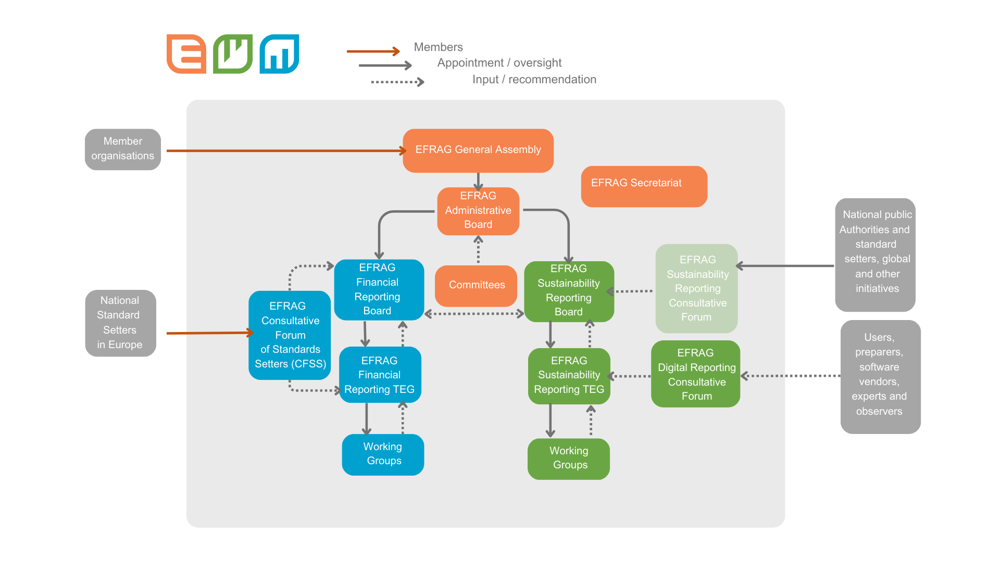
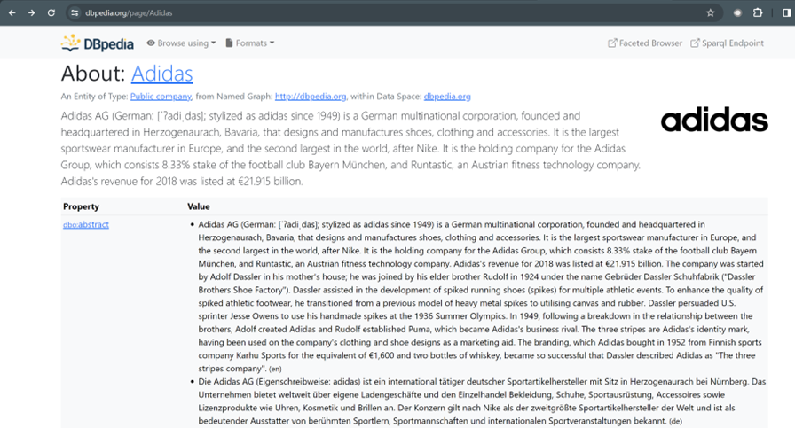
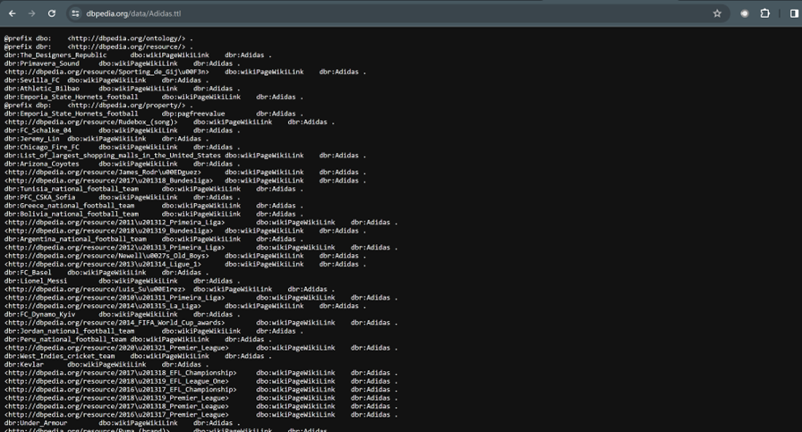
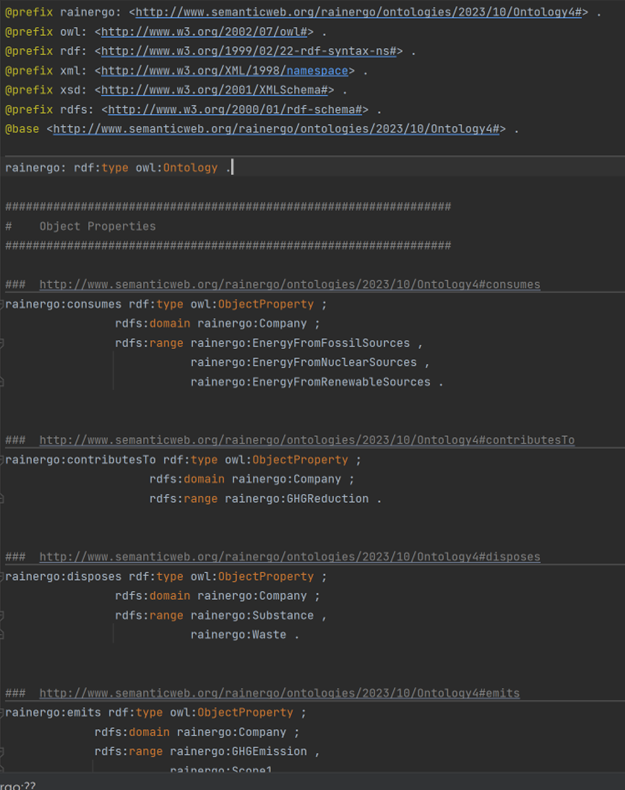
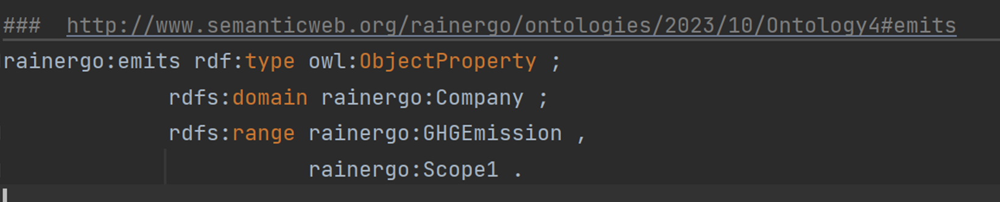

## INFO
This README explains some files in the "research"-folder.

 ---
### ESRS
#### Drafts
###### ESRS stands for "European Sustainability Reporting Standards", a legislation coordinated by [EFRAG](https://www.efrag.org/). EFRAG is a private association serving the European Commission in Corporate reporting matters:

###### EFRAG outlined the ESRS requirements in multiple drafts covering the three sustainability areas "Environment", "Social" and "Corporate" governance ("ESG") that will take effect from 2024 on. As this project only focuses on the Environmental reporting requirements (the "E" in "ESG"), the "research" folder only contains the drafts that are concerned with environmental reporting requirements under ESRS:

    - ESRS_GD: General Disclosures
    - ESRS_GR: General Requirements
    - ESRS_E1: Climate Change
    - ESRS_E2: Pollution
    - ESRS_E3: Water and marine resources
    - ESRS_E4: Biodiversity and ecosystems
    - ESRS_E5: Resource use and circular economy

###### The drafts define and describe the data points to be reported. The required data points were also aggregated in the Excel-table [ESRS_Draft_10_2023.xlsx](../research/ESRS/ESRS_Draft_10_2023.xlsx). In the "InNeo4j"-tab therein, we listed all the data points that were included in the sample JSON-files later to be loaded into the Knowledge Graph. We included at least one data point from each of the five draft sections (E1 to E5) (see the "Node" column in the individual worksheets). 

###### Starting January 1, 2024, ESRS will apply to all companies whose size exceeds certain thresholds:

    - Over 250 employees
    - More than 40€ million in annual revenue
    - More than 20€ million in total assets or balance sheet
    - Publicly-listed equities who have more than 10 employees or 20€ million revenue 
    - International and non-EU companies with more than 150€ million annual revenue within the EU and which have at least one subsidiary or branch in the EU exceeding certain thresholds

###### Small-and-medium enterprises ("SMEs") are also required to report under a more limited set (ESRS LSME) (starting January 1, 2026) and apply to listed EU Member State companies who meet at least two of the three following criteria:

    - Between 50-250 employees
    - More than 8€ million in annual revenue (and less than 40€ million)
    - More than 4€ million in total assets or balance sheet (and less than 20€ million)

#### Reporting format
###### ESRS reports will have to be reported in a format that is machine-readable. [EFRAG](https://www.efrag.org/News/Public-381/Call-for-tenders---Developing-the-XRBL-Taxonomy-of-the-first-set-of-ESRS) has stated that they will provide an ESRS digital taxonomy (a so-called XBRL taxonomy) that will form the basis of this electronic reporting. Please see also these drafts:

    - ESRS_Implementation_Guidance.pdf
    - ESRS_XBRL_Taxonomy.pdf

###### Companies today already publish their annual or quarterly reports in XBRL-format, but these XBRL-files do not yet contain ESG-data. From 2024 on, this will change as described above. Companies will probably aggregate existing corporate reporting with ESRS reporting in their annual reports and publish them both together in XBRL-format. 
###### In this project the module "A_read_xbrl.py" was designed to read such XBRL-files. Please see the "README.md-file" in the root folder.

### Ontologies
#### Introduction
###### The Knowledge Graph of this project is based on an Ontology developed in [Protégé](https://protege.stanford.edu/), a tool provided by Stanford University.
###### Ontologies are used to capture knowledge about some domain of interest. An ontology describes the concepts in the domain and also the relationships that hold between those concepts. 
###### The most widely used ontology language is [OWL](https://www.w3.org/TR/owl2-primer/) from the World Wide Web Consortium (W3C) which stands for "Web Ontology Language". OWL is built on top of RDFS which itself is built on top of RDF (Resource Description Framework) to describe network graphs i.e., nodes and links.

###### In OWL the fundamental construct is a triple consisting of a subject, predicate, and object. Triples can construct graphs because objects can be subjects and vice versa and so can be connected via predicate relationships. Such graphs are also known as triple stores.

###### Wikidata and dbpedia are public triple stores as they can be publicly accessed via http-requests. Every resource there can be represented as a collection of triples, which are both, machine-readable and human-readable. 
###### For instance, the company ["Adidas"](https://dbpedia.org/page/Adidas) in dbpedia can be represented in human-readable form ...

###### ... or in machine-readable form ...

###### ... if the format under "Formats" on top of the respective website is changed to a RDF-format such as Turtle (*.ttl-files). In the Turtle-representation of "Adidas", all the triples of subjects, predicates and objects are visible. 
###### For instance, the fact that "Adidas" has EUR 6,364,000,000 in equity is represented by the triple:
     dbr:Adidas    dbo:equity   "6.364E9"^^dbd:euro .

###### or explicitly:
    SUBJECT: dbr:Adidas    PREDICATE: dbo:equity   OBJECT: "6.364E9"^^dbd:euro .

###### The prefixes "dbr:" and "dbo:" refer to previously defined namespaces that make definitions unique and unambiguous and differentiate between similar/equal terms in different concepts and domains.

#### Ontology research
###### The pdf-files under the "ontologies"-folder were used to learn about ontologies and how to construct them. We particularly recommend the hands-on "PizzaTutorial" (see folder "PizzaTutorial") for more information on the subject.

#### Ontology construction
###### As previously stated, the Knowledge Graph of this project is based on an Ontology developed in [Protégé](https://protege.stanford.edu/). After constructing the ontology there, it was saved as a file in Turtle format and in this project was named "Ontology4.ttl".
###### The Protégé tool distinguishes between "Classes", "Object Properties", "Data Properties" and "Individuals":

> - Classes: <em>Defines NODES such as the Node "Company"</em>
> - Object Properties: <em>Defines graph RELATIONS between a DOMAIN (Source Node) and a RANGE (Target Node) such as "EMITS" between Source Node "Company" and Target Node "GHGEmission"</em> 
> - Data Properties: <em>Defines graph NODE PROPERTIES such as "Legal Entity Identfier" of a Node "Company"</em>
> - Individuals: <em>Individuals are instances of Classes and contain real data. For instance, a Node "Company" with concrete Node properties of "LEI:"549300JSX0Z4CW0V5023"" and "label:Adidas" </em>

###### The "Ontology4.ttl"-file contains "Classes", "Object Properties" and "Data Properties" but does not contain "Individuals" as the data later is imported separately. The "Ontology4.ttl"-file nevertheless contains the triples necessary to construct the Knowledge Graph <b><u>schema</u></b>:

"Emits" triples
###### For instance, the "Ontology4.ttl"-file contains the four triples to construct the "EMITS"-relationship:

###### These four triples are:
    TRIPLE_1: subject: "emits"       predicate: "type"       object: "ObjectProperty"
    TRIPLE_2: subject: "emits"       predicate: "domain"     object: "Company"
    TRIPLE_3: subject: "emits"       predicate: "range"      object: "GHGEmission"
    TRIPLE_4: subject: "emits"       predicate: "range"      object: "Scope1"

###### The namespaces [rdf](http://www.w3.org/1999/02/22-rdf-syntax-ns#), [owl](http://www.w3.org/2002/07/owl#) and [rdfs](http://www.w3.org/2000/01/rdf-schema#) are publicly defined and accessible namespaces that are listed and defined in the first lines of a Turtle-file. The namespace "rainergo" is not publicly defined and accessible, but refers to the inherent namespace of this custom ontology.

#### Python libraries for RDFs
###### There are multiple Python libraries to construct and read such triple stores but the one that stands out in number of downloads and citations is [rdflib](https://rdflib.readthedocs.io/en/stable/). We used this library to read the triples from the "Ontology4.ttl"-file into a rdf graph and to construct cypher queries for the data import based on this ontology. Please see "B_read_graph.py".

#### SPARQL
###### SPARQL ([*S*PARQL *P*rotocol *A*nd *R*DF *Q*uery *L*anguage](https://www.w3.org/TR/sparql11-query/)) is a query language that can read from and write to triple stores such as wikidata and dbpedia. It is comparable to SQL in relational databases. SPARQL queries in this project were used in "D_graph_construction.py" to populate the Knowledge Graph with external data from wikidata and dbpedia.

### Knowledge Graphs
###### We collected some sources to learn about knowledge graphs, which are listed in the "LINKS"-file. A good resource for the most widely used knowledge graph software "NEO4J" and its proprietary query language [Cypher](https://en.wikipedia.org/wiki/Cypher_(query_language)) can be found in the freely downloadable O'Reilly book [Graph Databases](https://neo4j.com/graph-databases-book/).

The next section is: [Data](../src/data/README-data.md)