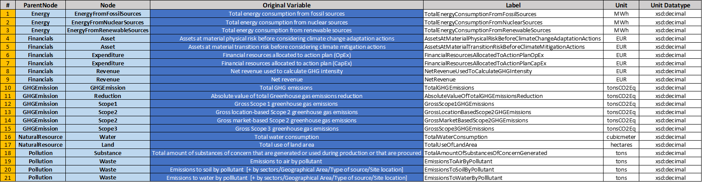

## README.md for data
### This "data" folder contains two sub-folders:
    1) "XBRLs": XBRL-files of company's annual or quarterly reports. Currently, these files do NOT contain ESG-data.
    2) "JSONs": JSON-files of company's sample ESG-data that later will be used to populate a NEO4J-Knowledge-Graph
    

### I. XBRLs:
##### A) Where to get the files from?
###### Companies today already publish their annual or quarterly reports in XBRL-format, but these XBRL-files do not yet contain ESG-data. From 2024 on, this will change as ESRS requires companies whose size exceeds certain thresholds to publish ESG-data in the form of XBRL-files. 

###### To show how such XBRL-files can be automatically parsed and read into JSON-files, here three sample XBRL-data-packages are provided for the following companies: Adidas AG ("adidasag.com"), BASF AG ("basfse.com") and Philips ("www.philips.com").
###### These XBRL-data-packages were downloaded from: [ESMA Databases and Registers - Corporate Reporting](https://www.esma.europa.eu/publications-and-data/databases-and-registers)

 ---

##### B) Files Format
###### The downloaded XBRL-data-packages must be organized in a certain manner so that the Python script "A_read_xbrl.py" later can parse and read these XBRLs into a JSON-file properly. The downloaded XBRL-files usually come in the form/hierarchy of:

    - META-INF
    - reports
    - url-of-company
        - xbrl
            - report-year
                - file-name.xsd
                - file-name_cal.xml
                - file-name_def.xml
                - file-name_lab.xml
                - file-name_pre.xml

###### These files must be reorganized as follows:
    
    - raw
        -> FOR ALL COMPANIES, COPY ALL "url-of-company"-FOLDERS (AND FILES THEREIN) INTO THIS "raw"-FOLDER:
        - url-of-company-1
        - url-of-company-2

        - reports 
            -> FOR ALL COMPANIES, COPY ALL XHTML-FILES IN THE ORIGINAL "reports"-FOLDER INTO THIS "reports"-FOLDER:
            - file-name.xhtml

        -> LEAVE THE OTHER FOLDERS (SUCH AS "www.esma.europa.eu", "efrag.org", "www.xbrl.org", "xbrl.ifrs.org") 
           UNTOUCHED AS THEY ARE NEEDED FOR PARSING THE FILES. 

###### The XBRL-files now can be parsed and read into JSON-files with the Python script "A_read_xbrl.py". 
###### If there are some problems while parsing, please refer to the attached document "XBRLs/XBRL_explained.pdf" or the GitHub page of the Python package that was used for parsing: [py-xbrl](https://github.com/manusimidt/py-xbrl) 
###### If an "xbrl.TaxonomyNotFound"-error occurs, please check the raised issue here: [py-xbrl issues](https://github.com/manusimidt/py-xbrl/issues/120#issue-1979211265)

 ---

### II. JSONs:
###### As we wanted to inject some sample ESG data into the Knowledge-Graph, we created some exemplary JSON-files assuming that such files in the course of the year 2024 will be extractable from the to-be-reported XBRL-files (see above). The required ESG data to be reported was outlined by ESMA and published in an Excel table:  [ESRS_Draft_10_2023.xlsx](../../research/ESRS/ESRS_Draft_10_2023.xlsx)

###### For readability reasons and clarity, we did not want to inject sample data for all to-be-reported data points into the Knowledge-Graph, but only for some of them. We used the following 21 data points:

###### The "JSONs"-sub-folder contains the following exemplary JSON-files containing these data points for three companies ("Adidas", "BASF", "Puma") and two years (2022, 2023), altogether 6 JSON-files: 
    - Adidas_2022.json
    - Adidas_2023.json
    - BASF_2022.json
    - BASF_2023.json
    - Puma_2022.json
    - Puma_2023.json
###### To create such exemplary json-files to be later read into the Knowledge-Graph, the template "templates/template.json" can be used.

The next section is: [Models](../../src/models/README-models.md)

