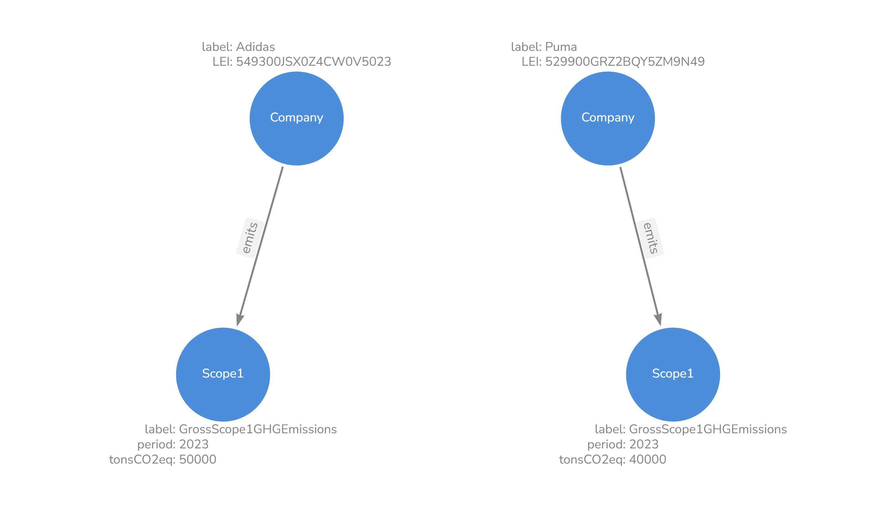

## README.md for models
### I. Files:
###### The models-folder contains Ontology-files and accompanying data. There is one ontology used in the project and thus only one ontology folder ("onto4"):
    - onto4
        - Ontology4.ttl
        - params
        - data_needed

### A) Ontology4.ttl
###### The name of the ontology ("Ontology4") has no special meaning and only reflects the latest version number. The ontology and file was created with the help of the free [Protégé](https://protege.stanford.edu/) tool provided by Stanford University. The file format is Turtle (".ttl"). The ontology can be visually represented:

###### The ontology subordinates and hosts all 21 sample ESG data points referred to earlier:

###### The intent in the construction of the ontology was to use general concept class and Node names. This would allow subordination of further data points under the existing Nodes. 
###### For instance: For the category "Scope 2 Greenhouse Gas Emissions" there are roughly 10 additional "Scope2"-related data points (i.e."gross", "net", "location based", "market based", etc.) to be reported (according to the [ESRS_Draft_10_2023.xlsx](../../research/ESRS/ESRS_Draft_10_2023.xlsx)) and loaded into the Knowledge-Graph later on. But in our sample JSON-file, there are only two of them, "GrossLocationBasedScope2GHGEmissions" and "GrossMarketBasedScope2GHGEmissions". But this does not pose a problem, as these further data points can all be subordinated under the Node "Scope2", just with different Node labels. 
###### The provided Node names try to generally cover the entire spectrum of environmental data ("E" in "ESG") to be reported under ESRS. The scope of our project was limited to environmental data and excludes social and governance aspects ("SG" in "ESG"). 

 ---

### B) params
###### For all Nodes in the ontology, the following parameter data needs to be provided:
    - unique_node_keys
    - node_value_props

#### - unique_node_keys
###### Every Node in the ontology and later in the Knowledge-Graph has certain properties that describe the Node. To identify and distinguish data points in the ontology and later in the Knowledge-Graph, certain Node properties need to be determined as <u>unique_node_keys</u>. <u>unique_node_keys</u> are comparable to primary keys in relational databases and are those Node properties that must be unique and that unambiguously identify a Node. They must be provided for each Node as a Python dictionary in the form:
    unique_node_keys = {"node_label":["node_property_name"]}. 
    
    Example: {"Company":["LEI"]}
###### The *unique_node_keys* for the provided "Ontology4" are ["period", "label"] for all Nodes except for the Node "Company" whose unique_node_keys is the "Legal Entity Identifier" ("LEI"):
    unique_node_keys = {
                        "Company": ["LEI"]
                        "Waste": ["period", "label"]
                        "Substance": ["period", "label"]
                        "EnergyFromNuclearSources": ["period", "label"]
                        "EnergyFromFossilSources": ["period", "label"]
                        "EnergyFromRenewableSources": ["period", "label"]
                        "GHGEmission": ["period", "label"]
                        "Scope1": ["period", "label"]
                        "Scope2": ["period", "label"]
                        "Scope3": ["period", "label"]
                        "GHGReduction": ["period", "label"]
                        "Land": ["period", "label"]
                        "Water": ["period", "label"]
                        "Asset": ["period", "label"]
                        "Expenditure": ["period", "label"]
                        "Revenue": ["period", "label"]
                        }
###### The "period" Node property usually refers to the business year of the respective company which mostly corresponds with the calendar year. The "label" property of a Node refers to its concrete data point name such as "GrossScope1GHGEmissions" for the Node "Scope1".

#### - node_value_props
###### Node value properties ("node_value_props") are quantitative properties that are usually of datatype "decimal" as defined in the w3-consortium's XMLSchema ("http://www.w3.org/2001/XMLSchema#") and express the units a Node label (such as "Gross Scope 1 Greenhouse Gas Emissions") is measured in. 
###### The Node value properties in the Knowledge-Graph could be stored in the Node itself, as depicted here:

###### The "Scope1"-Node on the left (picture above) with the label "GrossScope1GHGEmissions" for its "tonsCO2eq" property has a value of 50000. The "Company" with the label "Adidas" has an "emits"-relationship to this "Scope1"-Node indicating that "Adidas" emitted 50000 tons of CO2 equivalents "GrossScope1GHGEmissions" in 2023. 
###### This structure has the disadvantage that each "Company"-Node needs one "Scope1"-Node to store the data. A better solution to this is to store the units "tonsCO2eq" in the relationship "emits" instead of the Node itself as depicted in the next picture:

###### For the "Scope1"-Node with the label "GrossScope1GHGEmissions" the property values are now stored in the incoming relationship "emits" for both "Companies", "Adidas" and "Puma". With this approach, half of the target Nodes, i.e. Nodes with an incoming relationship, can be saved. All the Node properties provided in the "node_value_props"-dictionary will thus be stored in the incoming relationship of the target Nodes. To later create queries in the Cypher query language, this has to be taken into consideration. As an example:
    MATCH (s:SourceNode)-[r:Relationship]->[t:TargetNode] 
###### If the TargetNode 't' has a quantity property 'EUR' to express the value of the TargetNode 't', then this property is the quantity property of the Relationship 'r'. In the example here, 'EUR' would be the quantity property of the Relationship 'r', if 'EUR' would be set in the node_value_props dictionary like so: 
    node_value_props = {'TargetNode':'EUR'}
###### For this reason, the <u>node_value_props</u> must also be provided as a Python dictionary. In the "Ontology4" the "node_value_props", i.e. the Node properties that are stored in incoming relationships, are:
    node_value_props = {
                        "Waste": "tons",
                        "Substance": "tons",
                        "EnergyFromNuclearSources": "MWh",
                        "EnergyFromFossilSources": "MWh",
                        "EnergyFromRenewableSources": "MWh",
                        "GHGEmission": "tonsCO2Eq",
                        "Scope1": "tonsCO2Eq",
                        "Scope2": "tonsCO2Eq",
                        "Scope3": "tonsCO2Eq",
                        "GHGReduction": "tonsCO2Eq",
                        "Land": "hectares",
                        "Water": "cubicmetres",
                        "Asset": "EUR",
                        "Revenue": "EUR",
                        "Expenditure": "EUR"
                        }

### C) data_needed
###### After extracting ESG data from xbrl-files, the data therein is stored in standardized JSON-files as explained before in the README-data.md-file. Exemplary JSON-files are located in "/src/data/JSONs/" for "Adidas", "BASF" and "Puma". 
###### To load this data into the NEO4J Knowledge-Graph, Cypher queries first need to be generated. These Cypher queries must match the ontology represented by the "Ontology4.ttl"-file and must take the Node's peculiarities such as the <u>unique_node_keys</u> and the <u>node_value_props</u> (as described above) into account.
###### The Python script "B_rdf_graph.py" does exactly that. When initializing an instance of class "RDFGraph" passing a path to an ontology-file, it parses this ontology file, resolves all (subject-predicate-object) triples in there and builds a graph out of it. Passing the <u>unique_node_keys</u> and the <u>node_value_props</u> to the RDFGraph-method "create_query_templates()" will create four types of Cypher query templates:
    Query Templates for:
                        - NODES 
                        - RELATIONSHIPS
                        - CONSTRAINTS
                        - NAMESPACES
###### These Query templates are later used to load the data into the Knowledge-Graph.
##### Apply the *create_json_files_for_data_needed()-method*:
###### The RDFGraph-method "create_json_files_for_data_needed()" generates JSON-files with patterns for all Nodes and Relationships. These patterns are used to build the "node_template"-list and "relationship_template"-list in the "get_data_dicts()"-method in "C_read_data.py". They are stored in the "data_needed"-folder. All JSON-files in this folder must be represented in the "node_template"- and "relationship_template" in the "get_data_dicts()"-method.
##### Example:
##### Nodes
###### In the "data_needed" folder, there is, among others, an "Asset.json"-file with the following data:
    {"Asset": {"label": "<HERE_label_VALUE>", "period": "<HERE_period_VALUE>"}}
###### This Node information must also appear in the "node_template"-list of the "get_data_dicts()"-method in "C_read_data.py", because "Asset" is a Node.
###### There are two "Asset"-Node items in this "node_template"-list which are:
    {"Asset": {"label": "AssetsAtMaterialPhysicalRiskBeforeClimateChangeAdaptationActions", "period": company['period']}},
    {"Asset": {"label": "AssetsAtMaterialTransitionRiskBeforeClimateMitigationActions", "period": company['period']}},
###### These two "Asset"-Nodes correspond to two of the 21 data points. 
###### The "<HERE_label_VALUE>" placeholder has been replaced by the Node names/labels "AssetsAtMaterialPhysicalRiskBeforeClimateChangeAdaptationActions" and "AssetsAtMaterialTransitionRiskBeforeClimateMitigationActions".
###### The "<HERE_period_VALUE>" placeholder was replaced by a "company"-dictionary (in the "get_data_dicts()"-method) that refers to the deserialized JSON-files such as "Adidas_2022.json", "Adidas_2023.json", etc. depending on which data is loaded.
##### Relationships
###### In the "data_needed" folder, there is also, among others, a "Company_emits_Scope1.json"-file with the following data:
    {"Company_emits_Scope1": 
        {"source": {"Company": {"LEI": "<HERE_LEI_VALUE>"}}, 
         "target": {"Scope1": {"period": "<HERE_period_VALUE>", "label": "<HERE_label_VALUE>", "tonsCO2Eq": "<HERE_tonsCO2Eq_VALUE>"}}}}
###### This Relationship information must also appear in the "relationship_template"-list of the "get_data_dicts()"-method in "C_read_data.py", because "Company_emits_Scope1" represents the relationship "emits" between Node "Company" and Node "Scope1":
###### There is one "Company_emits_Scope1"-relationship in the "relationship_template"-list which is:
    {"Company_emits_Scope1": 
        {"source": {"Company": {"LEI": company['LEI']}}, 
         "target": {"Scope1": {"period": company['period'], "label": "GrossScope1GHGEmissions", "tonsCO2Eq": company["GrossScope1GHGEmissions"]}}}}
###### <u>Again</u>: 
###### The "<HERE_label_VALUE>" placeholder has been replaced by the Node name/label "GrossScope1GHGEmissions". 
###### The "company"-dictionary that replaced the "<HERE_LEI_VALUE>"-, "<HERE_period_VALUE>"- and "<HERE_tonsCO2Eq_VALUE>"-placeholders refer to the deserialized JSON-files such as "Adidas_2022.json", "Adidas_2023.json", etc. depending on which data is loaded.
###### To repeat: All JSON-files in the "data_needed" folder must be represented in the "node_template"-list and "relationship_template"-list in the "get_data_dicts()"-method.

### II. LOAD ADDITIONAL DATA:
###### Let's assume that not only 21 data points shall be loaded into the Knowledge-Graph, but far more than that. Here is the procedure of how to do that:

    1. Extract the XBRL-data into JSON-files as described in the README-data.md file.
    2. Check if all data points can be subordinated under the currently existing Nodes (see "Ontology4.ttl"-structure above):
        IF YOU NEED TO ADD FURTHER NODES, THEN:
        A. Remodel the ontolgy and create a new Ontolgy.ttl-file.
        B. Adjust the "unique_node_keys" and "node_value_props" in "params.py"
        C. Execute the create_json_files_for_data_needed()-method to get new "data_needed"-json-files as explained above
        -> Continue with 3.A.
    3. If the new data can be subordinated under the currently existing Nodes, then:
        A. Check if the desired data is in the extracted JSON-file ("Adidas_2022.json", for instance)
        B. Make sure this JSON-file is stored in the folder "/src/data/JSONs/".
        C. Add the NODE data to the "node_template"-list of the "get_data_dicts()"-method as described above
            -> Make sure to replace the placeholder "<HERE_label_VALUE>" with the Node name/label of the new data, such as "MyNewScope1GHGEmissionsDataPointName"
        D. Add the RELATIONSHIP data to the "relationship_template"-list of the "get_data_dicts()"-method as described above
            -> Make sure to replace the placeholder "<HERE_label_VALUE>" with the Node name/label of the new data, such as "MyNewScope1GHGEmissionsDataPointName"

###### That's it! The new data can now be loaded into the Knowledge-Graph. Please see the README.md-file in the root folder of this project.

The next section is: [Modules](../../src/README-modules.md)